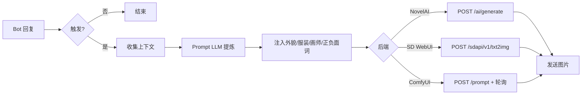
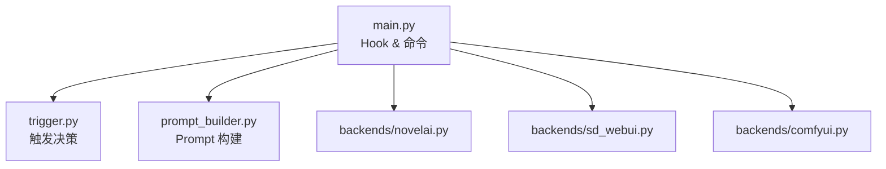

<div align="center">

# astrbot_plugin_auto_illust

**聊天自动配图 — LLM 感知上下文，按需生图**

Bot 回复后自动判断场景，调用 NovelAI / SD / ComfyUI 生成插图插入聊天

[]()
[](LICENSE)
[](https://github.com/AstrBotDevs/AstrBot)

[功能](#功能) · [快速开始](#快速开始) · [配置](#配置) · [架构](#架构) · [排障](#常见问题)

</div>

---

> **前置依赖**：本插件是 [AstrBot](https://github.com/AstrBotDevs/AstrBot) 的插件，需要至少一个可用的生图后端（[NovelAI](https://novelai.net) / [Stable Diffusion WebUI](https://github.com/AUTOMATIC1111/stable-diffusion-webui) / [ComfyUI](https://github.com/comfyanonymous/ComfyUI)）。

## 功能

| 功能 | 说明 |
|------|------|
| 🎨 自动配图 | Bot 回复后按概率/间隔自动生图插入，让聊天更有画面感 |
| 🧠 LLM 感知 | 读取最近对话上下文，提炼出应景的生图 prompt |
| 👗 人设一致 | 外貌特征 + 服装描述固定注入，每次生图保持角色一致 |
| 🎭 画师风格 | 可配画师串 + 固定正面提示词，控制画面风格 |
| 🔌 多后端 | NovelAI / Stable Diffusion WebUI / ComfyUI 一键切换 |
| 🎯 手动触发 | 支持 `/illustrate` 命令随时手动配图 |

## 快速开始

### 1. 安装

```bash
cd <AstrBot 数据目录>/data/plugins
git clone https://github.com/Yometenma/astrbot_plugin_auto_illust.git
```

重启 AstrBot 或在 WebUI 插件管理中启用。

### 2. 配置后端

打开 AstrBot WebUI → 插件设置 → `astrbot_plugin_auto_illust`：

**NovelAI**：
- `backend`: `novelai`
- `nai_key`: 你的 NovelAI API Key

**Stable Diffusion WebUI**：
- `backend`: `sd_webui`
- `sd_url`: `http://你的服务器:7860`
- 启动 SD 时需加 `--api` 参数

**ComfyUI**：
- `backend`: `comfyui`
- `comfyui_url`: `http://你的服务器:8188`
- `comfyui_workflow`: 粘贴 API 格式工作流 JSON（prompt 节点用 `[PROMPT]` 占位，负面词节点用 `[NEGATIVE_PROMPT]` 占位）

### 3. 配置人设

| 配置项 | 说明 |
|--------|------|
| `appearance` | Bot 的外貌，如 `1girl, silver hair, blue eyes, cat ears` |
| `costume` | 服装，如 `school uniform, knee socks` |
| `artist_tags` | 画师串，如 `artist:ask, artist:anmi` |
| `positive_prefix` | 正面质量词，如 `masterpiece, best quality` |
| `negative_prompt` | 负面词，不希望出现的内容 |

### 4. 使用

配置好之后正常聊天，插件自动配图。也可以随时发 `/illustrate` 手动触发。

## 配置

### 触发控制

| 配置项 | 类型 | 默认值 | 说明 |
|--------|------|--------|------|
| `trigger_mode` | string | `probability` | `probability` 概率 / `interval` 间隔 / `manual` 纯手动 |
| `probability` | float | `0.3` | 概率值（仅 probability 模式） |
| `interval` | int | `3` | 每 N 轮触发（仅 interval 模式） |
| `cooldown` | int | `2` | 两次触发最少间隔轮数 |

### 后端

| 配置项 | 类型 | 默认值 | 说明 |
|--------|------|--------|------|
| `backend` | string | `novelai` | `novelai` / `sd_webui` / `comfyui` |
| `nai_key` | string | 空 | NovelAI API Key |
| `sd_url` | string | `http://127.0.0.1:7860` | SD WebUI 地址 |
| `comfyui_url` | string | `http://127.0.0.1:8188` | ComfyUI 地址 |
| `comfyui_workflow` | text | 空 | ComfyUI 工作流 JSON |

### 生图参数

| 配置项 | 类型 | 默认值 | 说明 |
|--------|------|--------|------|
| `width` | int | `768` | 图片宽度 |
| `height` | int | `512` | 图片高度 |
| `steps` | int | `28` | 采样步数 |
| `scale` | float | `11.0` | CFG Scale（SD 建议 7） |
| `sampler` | string | `k_euler_ancestral` | 采样器 |
| `seed` | int | `-1` | 种子，-1 随机 |

### Prompt LLM

| 配置项 | 类型 | 默认值 | 说明 |
|--------|------|--------|------|
| `prompt_llm_enabled` | bool | `true` | 启用 LLM 提炼 prompt |
| `prompt_llm_system` | string | 空 | 自定义系统提示词，留空用内置默认 |

> 关掉 `prompt_llm_enabled` 则把最近对话内容直接当 prompt 用。如需独立 API 可填 `prompt_llm_api` / `prompt_llm_key` / `prompt_llm_model`，留空则复用 AstrBot 自带的 LLM。

---

## 架构

### 工作流程



### 模块结构



---

## 常见问题

### 配图不触发

- 检查 `trigger_mode` 是否设为 `manual`
- `probability` 模式下概率低，调高试试
- 输入 `/illustrate` 手动测试
- 看日志确认 `after_message_sent` 钩子是否触发

### 生图失败

- NovelAI：检查 `nai_key` 是否有效，账户余额是否充足
- SD WebUI：确认 `sd_url` 可访问，SD 启动时加了 `--api`
- ComfyUI：确认 `comfyui_url` 可访问，工作流 JSON 格式正确
- 查看日志获取具体错误信息

### 图片发送不出去

- 确认 AstrBot 的图片发送功能正常（平台是否支持图片消息）
- 检查生图返回的图片大小是否超限

### 人设不一致

- 检查 `appearance` 和 `costume` 是否填写
- 画师串和正面词会影响风格，调整试试

---

## 许可

MIT © yometenma
